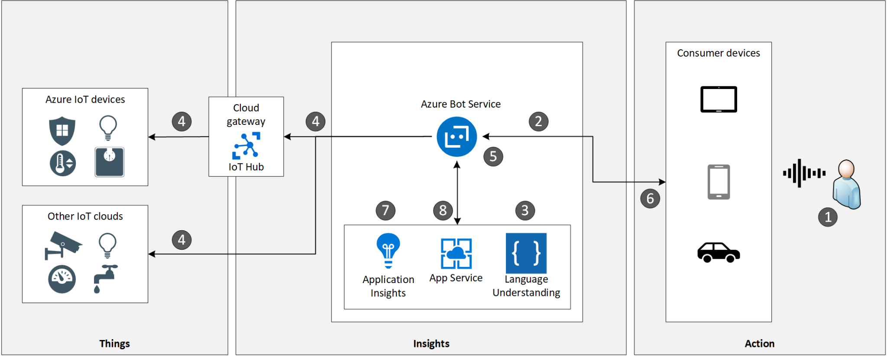

<!-- cSpell:ignore khilscher -->

# Controlling IoT devices using a Voice Assistant

[!INCLUDE [header_file](../../../includes/sol-idea-header.md)]

Create seamless conversational interfaces with all of your internet-accessible devices-from your connected television or fridge to devices in a connected power plant. By combining [Azure Speech Service](https://docs.microsoft.com/azure/cognitive-services/speech-service/overview), [Language Understanding Service](https://docs.microsoft.com/azure/cognitive-services/luis/) (LUIS) and [Azure Bot Framework](https://docs.microsoft.com/azure/bot-service/?view=azure-bot-service-4.0), developers can create natural, human-like conversational interfaces to control smart devices using [Azure IoT Hub](https://azure.microsoft.com/services/iot-hub/).

## Architecture

## Data Flow

1. Using voice, the user asks the voice assistant app to turn on the exterior house lights.
1. Using the Speech SDK, the app connects to Direct Line Speech. If keywords are confirmed by Keyword Verification, the speech is transcribed to text and sent to the Bot Service.
1. The Bot Service connects to Language Understanding service (LUIS). LUIS allows an application to understand what a person wants in their own words. The intent of the user's request (example: TurnOnLight) is returned to the Bot Service.
1. The request is relayed to the device.
    * If the device is connected to Azure IoT Hub, Bot Service connects to Azure IoT Hub Service API and sends the command to the device using either a Direct Method, an update to the device twin's Desired Property, or a Cloud to Device message.
    * If the device is connected to a third party IoT cloud, Bot Service connects to the third-party service API and sends a command to the device.
1. The Bot returns the results of the command to the user by generating a response that includes the text to speak.
1. The response is turned into audio using the Text-to-speech service and passed back to the voice assistant app by Direct Line Speech.
1. Application Insights gathers runtime telemetry to help development with bot performance and usage
1. Azure App Service hosts the Bot Service application.

## Components

1. [Voice assistants documentation](https://docs.microsoft.com/azure/cognitive-services/speech-service/index-voice-assistants)
1. [Tutorial: Voice-enable your bot using the Speech SDK](https://docs.microsoft.com/azure/cognitive-services/speech-service/tutorial-voice-enable-your-bot-speech-sdk)
1. [What is Direct Line Speech](https://docs.microsoft.com/azure/cognitive-services/speech-service/direct-line-speech)
1. [Azure Bot Service](https://docs.microsoft.com/azure/bot-service/?view=azure-bot-service-4.0)
1. [Speech to Text](https://docs.microsoft.com/azure/cognitive-services/speech-service/speech-to-text)
1. [Text to Speech](https://docs.microsoft.com/azure/cognitive-services/speech-service/text-to-speech)
1. [Custom Keywords](https://docs.microsoft.com/azure/cognitive-services/speech-service/speech-devices-sdk-create-kws)
1. [Language Understanding Service (LUIS)](https://docs.microsoft.com/azure/cognitive-services/luis/)
1. [Azure IoT Hub](https://azure.microsoft.com/services/iot-hub/)
